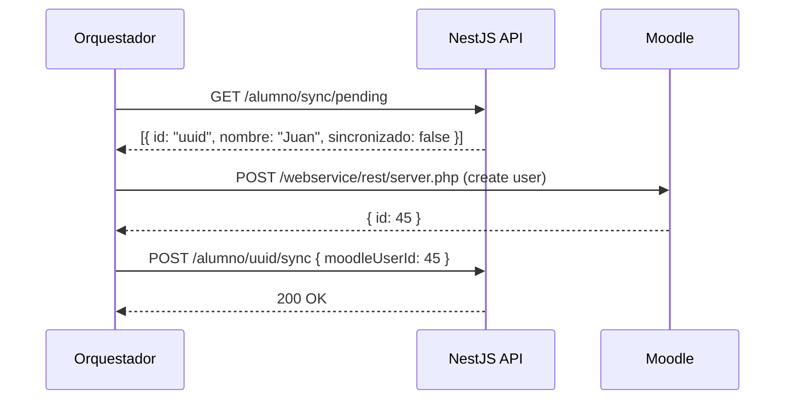
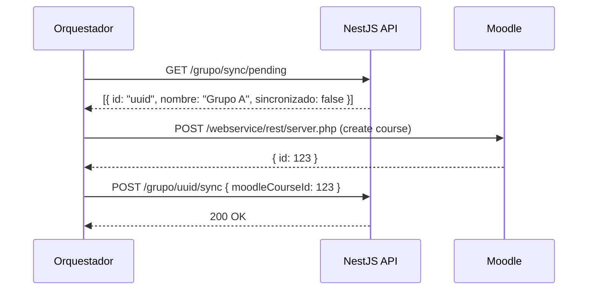
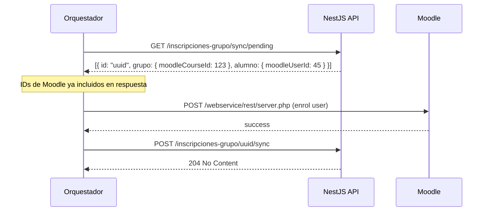

# 📡 API Endpoints - Documentación Completa

## Tabla de Contenidos

- [Endpoints para Orquestador](#endpoints-para-orquestador)
- [Endpoints CRUD Completos](#endpoints-crud-completos)
  - [Programa de Estudio](#programa-de-estudio)
  - [Asignatura](#asignatura)
  - [Docente](#docente)
  - [Alumno](#alumno)
  - [Grupo](#grupo)
  - [Inscripción Grupo](#inscripción-grupo)

---

## 🎯 Endpoints para Orquestador

> Estos endpoints están diseñados específicamente para que el Orquestador (Java) gestione la sincronización con Moodle.

### 1. Consulta de Recursos Pendientes

#### Alumnos Pendientes de Sincronización

```http
GET /alumno/sync/pending
```

**Descripción:** Retorna alumnos creados o modificados que aún no han sido sincronizados con Moodle.

**Filtros aplicados:**

- `sincronizado = false`
- `deletedAt IS NULL`

**Response:** `200 OK` o `204 No Content`

```json
[
  {
    "id": "uuid",
    "nombre": "Juan Pérez",
    "matricula": "A20240001",
    "cuatrimestreActual": 3,
    "sincronizado": false,
    "moodleUserId": null,
    "deletedAt": null
  }
]
```

**⚠️ Nota:** Este endpoint NO requiere relaciones pobladas porque el alumno no depende de otros recursos para ser creado en Moodle.

---

#### Alumnos Eliminados Pendientes

```http
GET /alumno/sync/deleted
```

**Descripción:** Retorna alumnos que fueron eliminados lógicamente y deben ser dados de baja en Moodle.

**Filtros aplicados:**

- `sincronizado = false`
- `deletedAt IS NOT NULL`

---

#### Docentes Pendientes de Sincronización

```http
GET /docente/sync/pending
```

**Descripción:** Retorna docentes creados o modificados pendientes de sincronización.

**Filtros aplicados:**

- `sincronizado = false`
- `deletedAt IS NULL`

**Response:** `200 OK` o `204 No Content`

```json
[
  {
    "id": "uuid",
    "nombre": "Dr. Roberto Gómez",
    "sincronizado": false,
    "moodleUserId": null,
    "deletedAt": null
  }
]
```

**⚠️ Nota:** Este endpoint NO requiere relaciones pobladas porque el docente no depende de otros recursos para ser creado en Moodle.

---

#### Docentes Eliminados Pendientes

```http
GET /docente/sync/deleted
```

**Descripción:** Retorna docentes eliminados lógicamente pendientes de baja en Moodle.

---

#### Grupos Pendientes de Sincronización

```http
GET /grupo/sync/pending
```

**Descripción:** Retorna grupos (cursos) creados o modificados pendientes de sincronización con relaciones pobladas.

**Filtros aplicados:**

- `sincronizado = false`
- `deletedAt IS NULL`

**Response:** `200 OK` o `204 No Content`

```json
[
  {
    "id": "uuid-grupo",
    "nombre": "Grupo A",
    "asignaturaNombreSnapshot": "Matemáticas I",
    "docenteNombreSnapshot": "Dr. Roberto Gómez",
    "sincronizado": false,
    "moodleCourseId": null,
    "asignatura": {
      "id": "uuid-asignatura",
      "nombre": "Matemáticas I",
      "cuatrimestre": 1,
      "programaEstudio": {
        "id": "uuid-programa",
        "nombre": "Ingeniería en Sistemas",
        "moodleCategoryId": 10
      }
    },
    "docente": {
      "id": "uuid-docente",
      "nombre": "Dr. Roberto Gómez",
      "moodleUserId": 67
    }
  }
]
```

**✅ Optimización para el Orquestador:**

- `asignatura.programaEstudio.moodleCategoryId` → ID de categoría necesario para crear el curso en Moodle
- `docente.moodleUserId` → ID del profesor en Moodle para asignarlo como teacher del curso
- Evita 2 llamadas adicionales al Backend por cada grupo

---

#### Grupos Eliminados Pendientes

```http
GET /grupo/sync/deleted
```

**Descripción:** Retorna grupos eliminados lógicamente pendientes de baja en Moodle.

---

#### Programas Pendientes de Sincronización

```http
GET /programa-estudio/sync/pending
```

**Descripción:** Retorna programas de estudio (categorías) creados o modificados pendientes de sincronización.

**Filtros aplicados:**

- `sincronizado = false`
- `deletedAt IS NULL`

**Response:** `200 OK` o `204 No Content`

```json
[
  {
    "id": "uuid",
    "nombre": "Ingeniería en Sistemas Computacionales",
    "cantidadCuatrimestres": 9,
    "sincronizado": false,
    "moodleCategoryId": null,
    "deletedAt": null
  }
]
```

**⚠️ Nota:** Este endpoint NO requiere relaciones pobladas porque el programa no depende de otros recursos.

---

#### Programas Eliminados Pendientes

```http
GET /programa-estudio/sync/deleted
```

**Descripción:** Retorna programas eliminados lógicamente pendientes de baja en Moodle.

---

#### Inscripciones Pendientes

```http
GET /inscripciones-grupo/sync/pending
```

**Descripción:** Retorna inscripciones de alumnos a grupos (enrolments) pendientes de sincronización con relaciones pobladas.

**Filtros aplicados:**

- `sincronizado = false`
- `deletedAt IS NULL`

**Response:** `200 OK` o `204 No Content`

```json
[
  {
    "id": "uuid-inscripcion",
    "grupoId": "uuid-grupo",
    "alumnoId": "uuid-alumno",
    "sincronizado": false,
    "createdAt": "2024-12-03T10:00:00Z",
    "deletedAt": null,
    "grupo": {
      "id": "uuid-grupo",
      "nombre": "Grupo A",
      "moodleCourseId": 123
    },
    "alumno": {
      "id": "uuid-alumno",
      "nombre": "Juan Pérez",
      "matricula": "A20240001",
      "moodleUserId": 45
    }
  }
]
```

**✅ Optimización para el Orquestador:**

- `grupo.moodleCourseId` → ID del curso en Moodle (necesario para el enrolment)
- `alumno.moodleUserId` → ID del usuario en Moodle (necesario para el enrolment)
- Evita 2 llamadas adicionales al Backend por cada inscripción
- **Requisito crítico:** Ambos IDs (`moodleCourseId` y `moodleUserId`) deben estar presentes (no null) para poder procesar la inscripción

---

#### Inscripciones Eliminadas Pendientes

```http
GET /inscripciones-grupo/sync/deleted
```

**Descripción:** Retorna des-inscripciones (unenrolments) pendientes de procesamiento en Moodle con relaciones pobladas.

**Filtros aplicados:**

- `sincronizado = false`
- `deletedAt IS NOT NULL`

**Response:** `200 OK` o `204 No Content`

```json
[
  {
    "id": "uuid-inscripcion",
    "grupoId": "uuid-grupo",
    "alumnoId": "uuid-alumno",
    "sincronizado": false,
    "createdAt": "2024-12-01T10:00:00Z",
    "deletedAt": "2024-12-03T15:30:00Z",
    "grupo": {
      "id": "uuid-grupo",
      "nombre": "Grupo A",
      "moodleCourseId": 123
    },
    "alumno": {
      "id": "uuid-alumno",
      "nombre": "Juan Pérez",
      "matricula": "A20240001",
      "moodleUserId": 45
    }
  }
]
```

**✅ Optimización para el Orquestador:**

- Misma optimización que `/sync/pending`
- Permite procesar unenrolments sin consultas adicionales

---

### 2. Confirmación de Sincronización

> Después de que el Orquestador sincroniza exitosamente un recurso en Moodle, debe llamar estos endpoints para confirmar la operación.

#### Confirmar Sincronización de Alumno

```http
POST /alumno/:id/sync
```

**Request Body:**

```json
{
  "moodleUserId": 45
}
```

**Descripción:** Marca el alumno como sincronizado y almacena el ID de Moodle.

**Actualiza:**

- `moodleUserId = 45`
- `sincronizado = true`

**Response:** `200 OK`

```json
{
  "id": "uuid",
  "nombre": "Juan Pérez",
  "matricula": "A20240001",
  "moodleUserId": 45,
  "sincronizado": true
}
```

---

#### Confirmar Sincronización de Docente

```http
POST /docente/:id/sync
```

**Request Body:**

```json
{
  "moodleUserId": 67
}
```

**Descripción:** Marca el docente como sincronizado y almacena el ID de Moodle.

---

#### Confirmar Sincronización de Grupo

```http
POST /grupo/:id/sync
```

**Request Body:**

```json
{
  "moodleCourseId": 123
}
```

**Descripción:** Marca el grupo (curso) como sincronizado y almacena el ID del curso en Moodle.

**Actualiza:**

- `moodleCourseId = 123`
- `sincronizado = true`

---

#### Confirmar Sincronización de Programa

```http
POST /programa-estudio/:id/sync
```

**Request Body:**

```json
{
  "moodleCategoryId": 12
}
```

**Descripción:** Marca el programa (categoría) como sincronizado y almacena el ID de la categoría en Moodle.

**Actualiza:**

- `moodleCategoryId = 12`
- `sincronizado = true`

---

#### Confirmar Sincronización de Inscripción

```http
POST /inscripciones-grupo/:id/sync
```

**Request Body:** _(vacío o sin body)_

**Descripción:** Marca la inscripción como sincronizada después de que Moodle confirme el enrolment.

**Actualiza:**

- `sincronizado = true`

**Response:** `204 No Content`

---

## 📚 Endpoints CRUD Completos

### Programa de Estudio

#### Crear Programa

```http
POST /programa-estudio
```

**Request Body:**

```json
{
  "nombre": "Ingeniería en Sistemas Computacionales",
  "cantidadCuatrimestres": 9
}
```

**Response:** `201 Created`

---

#### Obtener Todos los Programas

```http
GET /programa-estudio
```

**Response:** `200 OK` o `204 No Content`

---

#### Obtener Programa por ID

```http
GET /programa-estudio/:id
```

**Response:** `200 OK` o `404 Not Found`

---

#### Actualizar Programa

```http
PATCH /programa-estudio/:id
```

**Request Body:**

```json
{
  "nombre": "Nuevo Nombre",
  "cantidadCuatrimestres": 10
}
```

**Response:** `200 OK`

**⚠️ Nota:** Marca automáticamente `sincronizado = false`

---

#### Eliminar Programa (Soft Delete)

```http
DELETE /programa-estudio/:id
```

**Response:** `204 No Content`

**⚠️ Nota:** Marca `deletedAt = NOW` y `sincronizado = false`

---

#### Contar Programas

```http
GET /programa-estudio/count
```

**Response:** `200 OK`

```json
{
  "count": 5
}
```

---

### Asignatura

#### Crear Asignatura

```http
POST /asignatura
```

**Request Body:**

```json
{
  "nombre": "Matemáticas I",
  "cuatrimestre": 1,
  "programaEstudioId": "uuid"
}
```

**Response:** `201 Created`

---

#### Obtener Todas las Asignaturas

```http
GET /asignatura
```

**Response:** `200 OK` o `204 No Content`

---

#### Obtener Asignatura por ID

```http
GET /asignatura/:id
```

**Response:** `200 OK` con relaciones completas (ProgramaEstudio)

---

#### Actualizar Asignatura

```http
PATCH /asignatura/:id
```

**Request Body:**

```json
{
  "nombre": "Matemáticas Avanzadas I"
}
```

**Response:** `200 OK`

**⚠️ Regla C (Cascada):** Si cambia el `nombre`, marca todos los grupos de esta asignatura como `sincronizado = false`

---

#### Eliminar Asignatura

```http
DELETE /asignatura/:id
```

**Response:** `204 No Content`

---

#### Buscar por Programa

```http
GET /asignatura/programa/:programaId
```

**Response:** `200 OK`

---

#### Buscar por Cuatrimestre

```http
GET /asignatura/cuatrimestre/:numero
```

**Response:** `200 OK`

---

#### Contar Asignaturas

```http
GET /asignatura/count
```

---

### Docente

#### Crear Docente

```http
POST /docente
```

**Request Body:**

```json
{
  "nombre": "Dr. Roberto Gómez",
  "asignaturasCompetenciaIds": ["uuid1", "uuid2"]
}
```

**Response:** `201 Created`

**Nota:** `asignaturasCompetenciaIds` es opcional

---

#### Obtener Todos los Docentes

```http
GET /docente
```

**Response:** `200 OK` con competencias incluidas

---

#### Obtener Docente por ID

```http
GET /docente/:id
```

**Response:** `200 OK` con asignaturas de competencia

---

#### Actualizar Docente

```http
PATCH /docente/:id
```

**Request Body:**

```json
{
  "nombre": "Dr. Roberto Gómez Martínez",
  "asignaturasCompetenciaIds": ["uuid3", "uuid4"]
}
```

**Response:** `200 OK`

**⚠️ Nota:** Marca automáticamente `sincronizado = false`

---

#### Eliminar Docente (Soft Delete)

```http
DELETE /docente/:id
```

**Response:** `204 No Content`

**⚠️ Nota:** Marca `deletedAt = NOW` y `sincronizado = false`

---

#### Buscar Docentes por Competencia en Asignatura

```http
GET /docente/asignatura/:asignaturaId
```

**Descripción:** Retorna docentes que pueden impartir una asignatura específica

**Response:** `200 OK`

---

#### Agregar Competencia a Docente

```http
POST /docente/:id/competencia/:asignaturaId
```

**Response:** `200 OK`

```json
{
  "message": "Competencia agregada exitosamente"
}
```

---

#### Remover Competencia de Docente

```http
DELETE /docente/:id/competencia/:asignaturaId
```

**Response:** `200 OK`

---

#### Actualizar Competencias (Reemplazar Todas)

```http
PATCH /docente/:id/competencias
```

**Request Body:**

```json
{
  "asignaturaIds": ["uuid1", "uuid2", "uuid3"]
}
```

**Response:** `200 OK`

---

#### Contar Docentes

```http
GET /docente/count
```

---

### Alumno

#### Crear Alumno

```http
POST /alumno
```

**Request Body:**

```json
{
  "nombre": "Juan Pérez",
  "matricula": "A20240001",
  "cuatrimestreActual": 3
}
```

**Response:** `201 Created`

**Validación:** La matrícula debe ser única

---

#### Obtener Todos los Alumnos

```http
GET /alumno
```

**Response:** `200 OK` ordenados por fecha de creación (más recientes primero)

---

#### Obtener Alumno por ID

```http
GET /alumno/:id
```

**Response:** `200 OK`

---

#### Buscar Alumno por Matrícula

```http
GET /alumno/matricula/:matricula
```

**Response:** `200 OK` o `404 Not Found`

---

#### Buscar Alumnos por Cuatrimestre

```http
GET /alumno/cuatrimestre/:cuatrimestre
```

**Ejemplo:** `GET /alumno/cuatrimestre/3`

**Response:** `200 OK`

---

#### Actualizar Alumno

```http
PATCH /alumno/:id
```

**Request Body:**

```json
{
  "nombre": "Juan Carlos Pérez",
  "cuatrimestreActual": 4
}
```

**Response:** `200 OK`

**⚠️ Nota:** Marca automáticamente `sincronizado = false`

**Validación:** Si se actualiza la matrícula, verifica que no exista

---

#### Eliminar Alumno (Soft Delete)

```http
DELETE /alumno/:id
```

**Response:** `204 No Content`

**⚠️ Nota:** Marca `deletedAt = NOW` y `sincronizado = false`

---

#### Contar Alumnos

```http
GET /alumno/count
```

**Response:** `200 OK`

```json
{
  "count": 150
}
```

---

### Grupo

#### Crear Grupo

```http
POST /grupo
```

**Request Body:**

```json
{
  "nombre": "Grupo A",
  "asignaturaId": "uuid-asignatura",
  "docenteId": "uuid-docente",
  "alumnoIds": ["uuid-alumno1", "uuid-alumno2"]
}
```

**Response:** `201 Created`

**Validaciones:**

- La asignatura debe existir
- El docente debe existir
- El docente debe tener competencia en la asignatura
- Los alumnos (opcional) deben existir

**Nota:** Los snapshots de nombre de asignatura y docente se guardan automáticamente

---

#### Obtener Todos los Grupos

```http
GET /grupo
```

**Response:** `200 OK` con relaciones completas

---

#### Obtener Grupo por ID

```http
GET /grupo/:id
```

**Response:** `200 OK`

```json
{
  "id": "uuid",
  "nombre": "Grupo A",
  "asignaturaNombreSnapshot": "Matemáticas I",
  "docenteNombreSnapshot": "Dr. Roberto Gómez",
  "asignaturaId": "uuid-asignatura",
  "docenteId": "uuid-docente",
  "createdAt": "2024-12-01T10:00:00Z",
  "updatedAt": "2024-12-01T10:00:00Z"
}
```

---

#### Actualizar Grupo

```http
PATCH /grupo/:id
```

**Request Body:**

```json
{
  "nombre": "Grupo A - Matutino",
  "docenteId": "nuevo-docente-uuid"
}
```

**Response:** `200 OK`

**⚠️ Nota:** Marca automáticamente `sincronizado = false`

**Validación:** Si cambia el docente o asignatura, verifica competencia

---

#### Eliminar Grupo

```http
DELETE /grupo/:id
```

**Response:** `204 No Content`

---

#### Buscar Grupos por Asignatura

```http
GET /grupo/filter/asignatura/:asignaturaId
```

**Response:** `200 OK`

---

#### Buscar Grupos por Docente

```http
GET /grupo/filter/docente/:docenteId
```

**Response:** `200 OK`

---

#### Buscar Grupos por Alumno

```http
GET /grupo/filter/alumno/:alumnoId
```

**Descripción:** Retorna todos los grupos en los que está inscrito un alumno

**Response:** `200 OK`

---

#### Inscribir Alumno en Grupo

```http
POST /grupo/:id/alumno/:alumnoId
```

**Response:** `200 OK`

**⚠️ Nota:** Crea registro en `InscripcionGrupo` con `sincronizado = false`

---

#### Dar de Baja Alumno de Grupo

```http
DELETE /grupo/:id/alumno/:alumnoId
```

**Response:** `200 OK`

**⚠️ Nota:** Marca `deletedAt` en `InscripcionGrupo` y `sincronizado = false`

---

#### Actualizar Lista Completa de Alumnos

```http
PATCH /grupo/:id/alumnos
```

**Request Body:**

```json
{
  "alumnoIds": ["uuid1", "uuid2", "uuid3"]
}
```

**Response:** `200 OK`

**Descripción:** Reemplaza la lista completa de alumnos del grupo

**⚠️ Nota:**

- Agrega nuevos → crea `InscripcionGrupo` con `sincronizado = false`
- Remueve existentes → soft delete con `sincronizado = false`

---

#### Contar Alumnos en Grupo

```http
GET /grupo/:id/alumnos/count
```

**Response:** `200 OK`

```json
{
  "count": 25
}
```

---

#### Contar Grupos

```http
GET /grupo/stats/count
```

---

### Inscripción Grupo

#### Crear Inscripción

```http
POST /inscripciones-grupo
```

**Request Body:**

```json
{
  "grupoId": "uuid-grupo",
  "alumnoId": "uuid-alumno"
}
```

**Response:** `201 Created`

**⚠️ Nota:** Crea con `sincronizado = false`

---

#### Obtener Todas las Inscripciones

```http
GET /inscripciones-grupo
```

**Response:** `200 OK`

---

#### Obtener Inscripción por ID

```http
GET /inscripciones-grupo/:id
```

**Response:** `200 OK`

---

#### Obtener Inscripciones de un Grupo

```http
GET /inscripciones-grupo/grupo/:grupoId
```

**Response:** `200 OK`

---

#### Obtener Inscripciones de un Alumno

```http
GET /inscripciones-grupo/alumno/:alumnoId
```

**Response:** `200 OK`

---

#### Eliminar Inscripción (Soft Delete)

```http
DELETE /inscripciones-grupo/:id
```

**Response:** `204 No Content`

**⚠️ Nota:** Marca `deletedAt = NOW` y `sincronizado = false`

---

## 🔄 Flujo de Trabajo del Orquestador

### Sincronización de Alumno (Ejemplo Completo)



### Sincronización de Grupo (Curso)



### Sincronización de Inscripción (Enrolment)



---

## 📊 Resumen de Estados

| Campo          | Valor       | Significado                 | Acción del Orquestador     |
| -------------- | ----------- | --------------------------- | -------------------------- |
| `sincronizado` | `false`     | Pendiente de sincronización | Sincronizar con Moodle     |
| `sincronizado` | `true`      | Ya sincronizado             | Ninguna                    |
| `deletedAt`    | `null`      | Registro activo             | Crear/Actualizar en Moodle |
| `deletedAt`    | `timestamp` | Registro eliminado          | Eliminar en Moodle         |

---

## ⚠️ Notas Importantes

1. **Orden de Sincronización Recomendado:**

   ```
   1. ProgramaEstudio (Categories)
   2. Docentes (Teachers)
   3. Alumnos (Students)
   4. Grupos (Courses)
   5. InscripcionesGrupo (Enrolments)
   ```

2. **Optimización de Respuestas (Reducción de Llamadas al Backend):**
   - ✅ **Grupos:** Incluyen `asignatura.programaEstudio` y `docente` con sus `moodleId` poblados
   - ✅ **Inscripciones:** Incluyen `grupo` y `alumno` con sus `moodleId` poblados
   - ❌ **Alumnos/Docentes/Programas:** NO requieren relaciones (recursos independientes)
   - **Beneficio:** El Orquestador evita 2-3 llamadas adicionales por cada recurso

3. **Regla de Cascada:**
   - Cambiar nombre de Asignatura → invalida todos sus Grupos
   - El Orquestador debe re-sincronizar los grupos afectados

4. **Idempotencia:**
   - Todos los endpoints POST `/:id/sync` son idempotentes
   - Llamar múltiples veces con el mismo `moodleId` no causa problemas

5. **Manejo de Errores:**
   - Si Moodle falla, NO llamar el endpoint `/sync`
   - El registro permanecerá con `sincronizado = false`
   - En el siguiente ciclo, el Orquestador lo volverá a intentar

6. **Soft Delete:**
   - Los registros eliminados NO desaparecen de la BD
   - El Orquestador DEBE consultar `/sync/deleted` periódicamente
   - Después de eliminar en Moodle, confirmar con `/sync`

7. **Validación de IDs de Moodle en Inscripciones:**
   - El Orquestador DEBE verificar que `grupo.moodleCourseId` y `alumno.moodleUserId` NO sean `null`
   - Si alguno es `null`, significa que ese recurso aún no ha sido sincronizado
   - Debe procesar primero los Grupos y Alumnos pendientes antes de las Inscripciones

---

**Base URL:** `http://localhost:3000`  
**Documentación Swagger:** `http://localhost:3000/api`  
**Fecha:** 3 de diciembre de 2025  
**Versión:** 0.2A - Entities Branch

---

## ✅ Optimizaciones Implementadas

### Backend Optimizado para el Orquestador

Los siguientes endpoints ya incluyen **relaciones pobladas** con los `moodleId` necesarios, eliminando la necesidad de consultas adicionales:

1. **GET /grupo/sync/pending** y **GET /grupo/sync/deleted**
   - ✅ Incluyen `asignatura.programaEstudio.moodleCategoryId`
   - ✅ Incluyen `docente.moodleUserId`

2. **GET /inscripciones-grupo/sync/pending** y **GET /inscripciones-grupo/sync/deleted**
   - ✅ Incluyen `grupo.moodleCourseId`
   - ✅ Incluyen `alumno.moodleUserId`

**Beneficio:** El Orquestador evita 2-3 llamadas HTTP adicionales por cada recurso, reduciendo latencia y carga del servidor.
